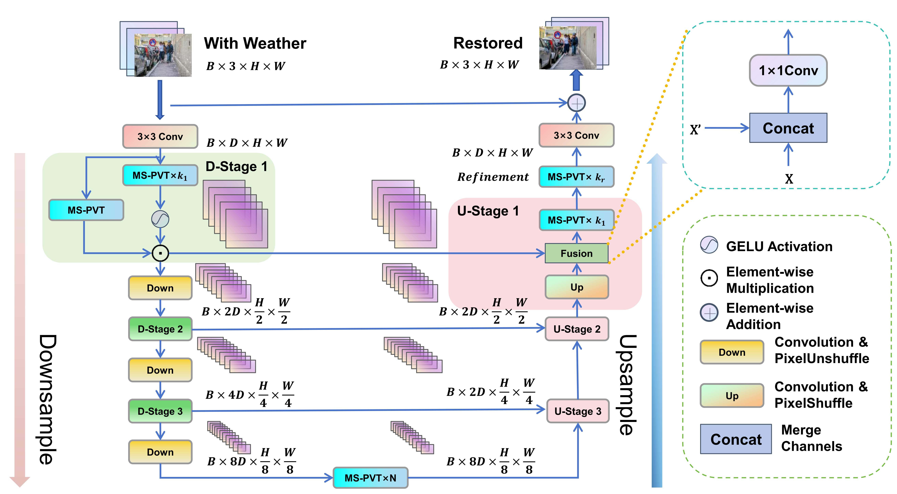

# WeatherRemover

This is the source code for WeatherRemover(WeatherRemover: All-in-one Adverse Weather Removal with Multi-scale Feature Map Compression).

## Abstract

Photographs captured in poor weather conditions frequently exhibit blurriness, occlusion, and low brightness due to the interference of elements such as rain, snow, and fog. These issues significantly hinder computer vision tasks, including object detection and semantic segmentation. Consequently, the removal of adverse weather effects from images is essential for enhancing image quality. Current methods predominantly address specific weather conditions, such as rain or snow, and necessitate tailored datasets for training. While some approaches can manage mixed weather conditions by training on diverse datasets, they often face inefficiencies, including lengthy inference times, large parameter sizes, and rigid input image dimensions. In this study, we introduce the WeatherRemover model, designed to efficiently and flexibly eliminate various weather elements from images. The WeatherFormer component of our model utilizes a UNet-like network architecture integrated with a gating mechanism and a Transformer. This combination facilitates selective information learning and captures features across different scales through upsampling and downsampling techniques. To enhance the Transformer's performance, we implement two optimization mechanisms: linear Spatial Reduction Attention to condense feature maps, thereby reducing computational demands and inference times, and channel-wise attention based on convolutional neural networks to accommodate feature maps of varying scales. These mechanisms ensure consistent input and output image sizes and enhance the learning of local features. Experimental outcomes affirm that our model adeptly handles images of any size, demonstrating superior performance in both single and multi-weather removal tasks. Notably, our model achieves shorter inference times and smaller parameter sizes, underscoring its efficiency and flexibility.

## Architecture



## Requirement

The project is built with Python 3.11.5,CUDA 11.8.Using the following command to install dependency packages

```
pip install -r requirements.txt
```

## Checkpoints

Checkpoints are available on [Baidu Netdisk](https://pan.baidu.com/s/1p_O4WWGI4xyj4xA-WaSGeg?pwd=xf1g), password:xf1g

## Dataset Structure

Download the datasets and arrange them in the following format.

```
Your_dataset
|── train
|	|── input
|	|── gt
|	|── train.txt
|
|── test
|	|── input
|	|── gt
|	|── test_all.txt
```

The file `train.txt` contains the relative paths of each image in the training set within the `input` directory, such as `input/1.png`. The file `test_all.txt` contains the relative paths of each image in the test set within the `input` directory.Note that the filenames in the `input` directory must be the same as the filenames in the `gt` directory.

## Document Introduction

`model/cmformer.py`is where our model is located. `test/measure.py`is used for evaluation. `utils/train_data_functions.py`and `utils/val_data_functions.py`related to dataset processing.  `test`directory is used to evaluate the model.

## Train

All experiments were completed on a single **NVIDIA RTX 3090**.

First, modify the value of `train_data_dir` to the path of the training set and the value of `val_data_dir` to the path of the test set in `train_step.py`. Then, use the following command to start the training.

```
python train_step.py -learning_rate 0.0003 -num_steps 30000 -train_batch_size 8 -crop_size 128 128 -save_step 10000 -exp_name ./checkpoint/raindrop [-checkpoint]
```

`-exp_name`:Specify the path for saving checkpoints

`-save_step`:Specify the interval for saving checkpoints

`-crop_size`:Specify the image size to be used during training

`-checkpoint`:Specify the path of the checkpoint used for training recovery

During the training process, the training is divided into several stages, each using different learning rates, image sizes, and batch sizes. Therefore, we will execute different commands in stages to complete the training.

## Test

Code files with filenames starting with `test` are used to evaluate various datasets in `test`diretory. Modify the value of `val_data_dir` to the path of the test set, and then run the following command to perform the evaluation.

```
python test_outdoor_rain.py -save_place ./outdoor_rain -val_batch_size 1 -checkpoint path
```

`-save_place`:Specify the location to save the repaired image and results.

`-checkpoint`:Select the path of the checkpoint to be used.
